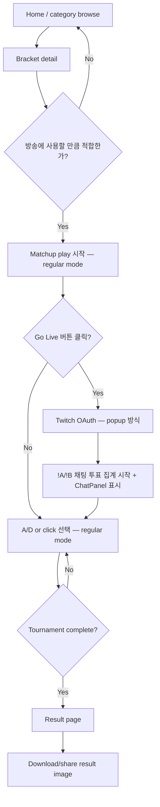
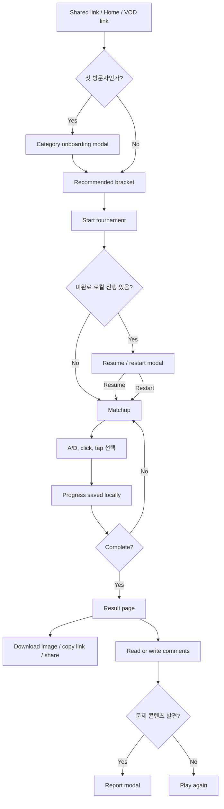
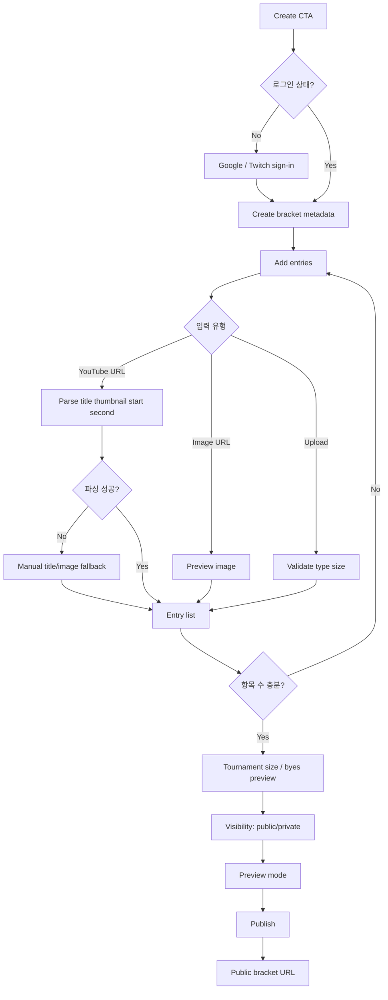
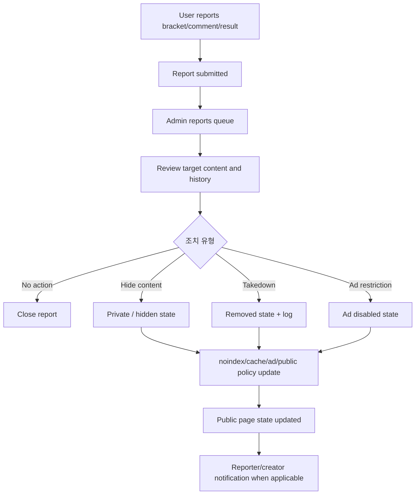

# UX Design Specification saveonedropone

**Author:** GM  
**Date:** 2026-05-09

---

## Executive Summary

### Project Vision

Save One Drop One은 스트리머가 준비 없이 방송에 올릴 수 있는 1v1 브라켓 콘텐츠 플랫폼이다. UX의 핵심은 "브라켓 도구"가 아니라 "방송-ready Bracket Pack"을 선택, 실행, 공유, 재플레이하게 만드는 것이다.

제품 경험은 네 가지 루프를 동시에 만족해야 한다.

1. 스트리머: Bracket Pack 발견 -> 방송 세팅 -> OBS 진행 -> 결과 공유
2. 시청자: 방송/공유 링크 유입 -> 익명 플레이 -> 결과 공유 -> Play again 유도
3. UGC 제작자: 브라켓 생성 -> 공개/SEO 인덱싱 -> 방송/커뮤니티 배포
4. 운영자: 신고 수신 -> 검토 -> 비공개/takedown -> 검색/광고/공개 상태 동기화

기존 디자인 방향은 `Streamer Native`로 확정한다. 새 디자인 방향을 탐색하지 않고, `docs/design`의 어두운 스트리머 친화 UI, 고대비 카드, 보라/초록 액센트, mono 카운터, 방송 화면 중심 구성을 확장한다.

### Target Users

**스트리머**

- Twitch/YouTube 미드티어 스트리머
- 목표: 10분 이내 방송 콘텐츠 준비, OBS에서 깨지지 않는 진행, 채팅 참여 유도
- 주요 디바이스: 데스크톱, OBS 브라우저 소스, 방송 중 키보드 조작

**시청자**

- 방송 채팅, VOD, SNS, Discord에서 링크로 유입되는 팬
- 목표: 계정 없이 즉시 플레이, 결과 이미지/링크 공유, 다른 사람 결과에 반응
- 주요 디바이스: 모바일 우선, 데스크톱/태블릿 보조

**UGC 제작자**

- 팬덤 콘텐츠 제작자, 유튜버, 커뮤니티 운영자
- 목표: YouTube URL과 이미지 URL로 빠르게 항목을 만들고 공개 브라켓을 배포
- 주요 디바이스: 데스크톱/태블릿

**운영자**

- 신고, DMCA, 광고 안전성, 공개 상태를 관리하는 관리자
- 목표: 문제가 있는 브라켓/댓글을 빠르게 식별하고 공개/검색/광고 상태를 일관되게 조치
- 주요 디바이스: 데스크톱

### Key Design Challenges

- 기존 UI kit은 Home, Matchup, Result 중심이라 streamer control, live chat voting, comments, report/takedown, create flow, onboarding, admin flow가 비어 있다.
- OBS는 1920x1080 고정 캔버스에서 안정성이 우선이고, 일반 플레이는 모바일/태블릿/데스크톱 반응형이 필요하다.
- 익명 플레이와 로그인 생성 권한이 섞여 있으므로 CTA와 권한 설명을 마찰 없이 분리해야 한다.
- UGC moderation 상태는 공개 UI, SEO, OG, 댓글, 광고 eligibility까지 한 번에 반영되어야 한다.
- 접근성은 "보조 기능"이 아니라 핵심 게임 루프의 입력 방식이다. A/D 키, Tab, Enter/Space만으로 16강 이상을 완료할 수 있어야 한다.

### Design Opportunities

- 브라켓 선택 순간부터 "방송에 바로 올릴 수 있음"을 확인시키는 OBS URL, viewer link를 하나의 방송 시작 패널로 묶는다.
- Matchup 화면의 대칭 구조를 일반 플레이, OBS 화면, live chat voting 상태에서 공유해 학습 비용을 낮춘다.
- 결과 화면은 정적 승자 발표가 아니라 "내 결과가 틀렸다고 말하게 만드는" 공유/댓글/재플레이 허브가 되어야 한다.
- 신고/비공개/takedown은 별도 관리자 도구로 숨기되, 공개 페이지에서는 사용자가 이해할 수 있는 최소한의 상태 메시지만 노출한다.

---

## UX Principles

### 1. Broadcast First, Not Dashboard First

스트리머에게 첫 가치는 관리 기능이 아니라 방송 투입이다. 홈과 브라켓 상세 화면의 우선순위는 "어떤 콘텐츠인가", "얼마나 걸리는가", "OBS에 어떻게 넣는가", "시청자 링크는 어디인가" 순서다.

### 2. Anonymous Until Creation

탐색, 플레이, 결과 공유, 댓글 작성은 계정 없이 가능해야 한다. 로그인 요구는 브라켓 생성, 소유 브라켓 관리, 즐겨찾기 같은 저장/소유 기능에서만 등장한다.

### 3. Every Result Is a Re-entry Point

결과 화면과 공유 URL은 도착점이 아니라 재시작점이다. "Play again", "Copy result link", "Download image", "Comment", "Report"가 명확하게 보여야 한다.

### 4. State Is Product Copy

loading, empty, error, offline, removed, private, rate-limited 상태는 사용자가 다음 행동을 이해하는 순간이다. 모든 상태는 짧고 기능적인 문장으로 쓴다.

### 5. Same Bracket, Different Surfaces

동일한 Bracket Pack은 Home card, matchup, OBS, viewer vote, result, share preview에서 다르게 표현된다. 그러나 제목, 썸네일, category/tag, item count는 일관되어야 한다.

---

## Visual Reference Contract

모든 MVP 화면은 `docs/design`의 `Streamer Native` 방향을 확장한다. 새 화면을 만들 때도 별도 디자인 시스템을 만들지 않고 기존 토큰, 레이아웃 문법, 카피 톤을 먼저 적용한다.

- Surface stack: page는 `#0e0e12`, nav/input은 `#0a0a0e`, cards/panels는 `#18181f`, secondary/hover surfaces는 `#1f1f28`을 기본으로 한다.
- Accent vocabulary: purple `#7c3aed`는 primary action, active state, brand emphasis에 쓰고, green `#38e07b`는 live, win, positive state에 쓴다.
- Layout grammar: 56px sticky top nav, 220px browse sidebar, 320px live/vote right rail, 24-32px content gutters를 기준으로 파생한다.
- Shape/elevation: cards는 10px radius, matchup/media tiles는 12px radius, buttons/inputs는 6px radius를 기본으로 한다. elevation은 shadow가 아니라 `rgba(255,255,255,0.06)` hairline으로 만든다.
- Typography: Inter를 body/display 전반에 사용하고, JetBrains Mono는 section labels, stats/counters, vote percentages, timers, keyboard hints에만 제한적으로 사용한다.
- Motion: 기본 표면은 정적이다. 선택/advance feedback은 150ms 안팎의 state confirmation으로 제한하고, layout shift나 spectacle animation을 만들지 않는다.
- Imagery: thumbnail과 contestant media는 edge-to-edge로 두고, caption legibility를 위해 bottom protection gradient를 사용한다. real image가 없을 때는 기존 diagonal-stripe placeholder 문법을 유지한다.
- New surfaces: Streamer Control, OBS capture layout, Live Chat Voting, Create, Admin 화면은 이 계약을 먼저 따른 뒤 필요한 패턴만 추가한다.

---

## Screen Inventory

### MVP Screens

| 화면 | 경로/표면 | 주 사용자 | 렌더링 | 목적 |
|---|---|---|---|---|
| Home / Browse | `/`, `/brackets`, `/categories/:categorySlug` | 시청자, 스트리머 | SSR | featured/trending/category 기반 브라켓 발견 |
| First-visit onboarding modal | Home 진입 시 조건부 | 시청자 | Client overlay | 관심 카테고리 선택 후 즉시 브라켓 추천 |
| Matchup play | `/play/:bracketSlug` | 시청자, 스트리머 | CSR 중심 | 1v1 선택, undo/restart, 로컬 저장, 채팅 투표 집계 표시 |
| Streamer live mode | Matchup play 내 opt-in 패널 | 스트리머 | CSR | Twitch 채팅 연동 활성화, !A/!B 투표 집계 |
| Result page | `/results/:resultId` | 시청자, 스트리머 | SSR | 챔피언, 경로, 통계, 공유, 댓글 |
| Full Community Ranking View | Result 내 modal | 시청자 | Client overlay | 전체 N명 커뮤니티 선택 % 바 차트 랭킹 |
| Full Bracket Modal | Result 내 modal | 시청자 | Client overlay | 전체 브라켓 트리 zoom/drag, 라운드 범위 필터, Save Image |
| Create bracket flow | `/create`, `/create/new` | UGC 제작자 | SSR + CSR form | 브라켓 메타, 항목, 공개 설정, 공개 브라켓 URL 생성 |
| Auth callback / sign-in sheet | `/auth/callback`, modal | 제작자 | SSR/action | Google/Twitch 로그인 |

### Growth Screens

| 화면 | 목적 |
|---|---|
| Result comparison | 두 사용자 결과 나란히 비교. MVP 바이럴 루프 검증 후 추가 |
| Streamer dashboard | 만든 Bracket Pack, 플레이 통계, 방송 재사용 지표 |
| Favorites / history | 재방문과 저장된 브라켓 탐색 |
| Creator analytics | Bracket Pack별 플레이, 공유, 유입, completion |
| YouTube chat integration setup | Twitch MVP 안정화 이후 YouTube 채팅 명령어 연동 설정 |

---

## User Journey Flows

### Journey 1: Streamer First Broadcast Flow

**Goal:** 스트리머가 10분 이내 Bracket Pack을 OBS에 올리고 방송을 시작한다.

**Required UI states**

- Live mode: connecting, connected, disconnected, chat disconnected (투표 집계 없음 표시)
- Matchup: vote tally 표시 (A% vs B%), no votes yet, votes updating

**Key UX requirements**

- 스트리머는 일반 플레이 화면과 동일한 URL을 사용한다. 별도 OBS URL 없음. 화면 공유(OBS screen capture)로 방송에 올린다.
- Live mode는 Matchup 화면 내 opt-in 패널이다. 채널 연동 후 !A/!B 집계가 시작된다.
- 채팅 투표 집계는 매치업 화면의 우측 또는 하단 compact 영역에 표시한다. 스트리머 화면에 보이므로 시청자도 방송 화면에서 집계를 볼 수 있다.

### Journey 2: Viewer Play, Share, Comment Flow

**Goal:** 시청자가 계정 없이 플레이를 완료하고 결과를 공유하거나 댓글로 반응한다.

**Required UI states**

- Onboarding: not shown, category selected, dismissed, category list loading
- Matchup: first load, image loading, keyboard hint, undo available/unavailable, local save success implicit, localStorage unavailable warning
- Result: image export pending, export failed, share copied, no community stats yet, comments empty, comments disabled on moderated result

**Key UX requirements**

- 첫 방문 온보딩은 플레이를 막는 마케팅 팝업이 아니라 카테고리 선택 shortcut이어야 한다.
- 모바일 matchup은 두 항목을 상하 또는 swipe-friendly stacked layout으로 제공하되, A/D 키 설명은 데스크톱에서만 강조한다.
- 결과 화면의 primary CTA는 상황별로 달라진다. 완료 직후에는 "Download image" 또는 "Copy result link", 공유 링크 유입자는 "Play again"을 우선한다.

### Journey 3: UGC Bracket Creation Flow

**Goal:** 제작자가 YouTube URL과 이미지 URL로 Bracket Pack을 빠르게 만들고 공개한다.

**Required UI states**

- Auth: provider pending, denied, callback failed
- Metadata: missing title, slug conflict, category/tag required
- Entry parse: pending, quota/rate limited, unsupported URL, thumbnail unavailable, CORS/hotlink failure
- Image upload: invalid type, over 10MB, upload failed
- Publish: public, private, under review, blocked by validation

**Key UX requirements**

- 항목 추가는 table/form보다 "paste queue" 중심이어야 한다. URL을 붙여넣으면 row가 생기고 각 row에서 title/image/start second를 수정한다.
- 2의 거듭제곱이 아닌 항목 수는 오류가 아니라 preview로 설명한다. 예: "133 entries -> byes will be assigned automatically."
- 공개 전 preview는 Home card, matchup card, result share preview가 어떻게 보일지 보여준다.

### Journey 4: Moderation, Report, Takedown Flow

**Goal:** 운영자가 신고와 DMCA를 처리하고 공개/검색/광고 상태를 일관되게 변경한다.

**Required UI states**

- Public report modal: submitted, duplicate/too frequent, validation error
- Admin queue: unread, grouped duplicates, high-risk, DMCA, resolved
- Public content: available, private, removed, under review, comments locked, ads disabled
- Takedown log: action pending, action complete, restore requested, restored

**Key UX requirements**

- 공개 페이지에서는 정책 세부를 노출하지 않는다. "This bracket is unavailable"처럼 짧고 일반적인 문구를 쓴다.
- 관리자 화면은 신고 대상, 원본 URL, 신고 사유, 누적 신고 수, 공개 상태, 검색 상태, 광고 상태, 최근 조치 로그를 한 화면에 보여준다.
- Moderation action은 확인 modal을 사용하고, 조치 결과가 SEO/noindex/cache/ad eligibility에 미치는 영향을 명시한다.

---

## Screen Specifications

### Home / Browse

**Purpose:** 사용자가 방송 또는 개인 플레이에 적합한 Bracket Pack을 빠르게 발견한다.

**Primary content**

- Sticky top nav: logo, search, screen/route toggles, create CTA
- Sidebar: category list, live streamer rail
- Hero/featured bracket: 제목, thumbnail, item count, total plays, live count
- Trending grid: BracketCard 반복
- Quick-play area: 가장 빠른 시작 후보

**States**

- Loading: hero skeleton + card skeleton grid
- Empty category: "No brackets in this tag yet" + broader category CTA
- Error: retry action, cached/trending fallback 가능
- No live streamers: rail은 유지하되 빈 상태 메시지 표시

**Notes**

- 기존 `HomeScreen.jsx`, `Sidebar.jsx`, `BracketCard.jsx`, `TopNav.jsx`를 기반으로 확장한다.
- 모바일에서는 sidebar를 category drawer 또는 horizontal category rail로 접는다.

### Matchup Play

**Purpose:** 계정 없이 빠르고 명확한 A/B 선택을 반복한다.

**Primary content**

- Round/match progress bar or dots
- Two contestant cards
- VS divider
- Keyboard hint: "Press A / D · or click either side"
- Toolbar: undo, restart, share current bracket, report, Go Live (streamer mode 진입)
- Optional community/vote hint if session-linked

**States**

- Image loading per card
- Selected/advance feedback은 `Streamer Native`의 정적 표면을 해치지 않도록 짧고 layout shift 없이 처리
- Undo disabled on first match
- localStorage unavailable: 계속 플레이 가능하되 refresh persistence 없음 표시

**Notes**

- 기존 `MatchupScreen.jsx`를 기반으로 한다.
- **레이아웃:** regular mode는 `1fr` 단일 컬럼. streamer live mode 활성화 시 `1fr 320px`로 전환 (ChatPanel 표시).
- **ContestantCard `%chat` 배지:** streamer live mode가 활성화되고 chat이 연결된 상태에서만 표시. regular mode에서는 렌더링하지 않음.
- **Live mode 진입점:** Matchup toolbar의 "Go Live" 버튼. 클릭 시 Twitch OAuth → 연동 완료 후 ChatPanel 슬라이드인. 세션 중 비활성화 시 ChatPanel 콜랩스, 배지 숨김, tally 초기화.
- Viewer vote summary는 기존 `ChatPanel`/`VoteTally`의 320px right rail, mono label, purple/green split bar 문법을 계승한다.

### Streamer Live Mode (Matchup 내 패널)

**Purpose:** 스트리머가 일반 플레이 화면에서 Twitch 채팅을 연동해 !A/!B 투표 집계를 받는다. 별도 화면이 아니라 Matchup 화면의 opt-in 패널이다. YouTube 채팅 연동은 Twitch MVP 안정화 이후 Growth 범위로 둔다.

**Primary content**

- Twitch 채널 연동 버튼
- 연동 상태 chip (connected / disconnected)
- 실시간 !A/!B 투표 집계 바 (A% vs B%)
- 현재 매치 vote count

**States**

- Not connected: 채널 연동 CTA 표시
- Connecting: 인증 pending
- Connected: 실시간 집계 표시
- Disconnected mid-session: last known tally 표시 + reconnect 유도
- No votes yet: "Waiting for chat votes..."

**Notes**

- 스트리머는 이 화면을 OBS screen capture로 방송에 올린다. 별도 OBS URL 없음.
- 투표 집계는 스트리머 화면에 보이므로 시청자도 방송 화면에서 집계를 확인한다.
- 키보드 focus ring을 숨기면 안 된다. 방송 중 실수 방지가 운영 안정성에 중요하다.
- **OAuth 방식:** "Go Live" 클릭 시 OAuth는 반드시 popup 방식으로 구현한다. redirect는 현재 매치 상태를 파괴한다.
- **OAuth scope:** Live Mode 채팅 연동은 bracket creation 로그인(FR47)과 별개의 OAuth flow다. Twitch 채팅 수집 동의가 필요하며, 구현 scope는 architecture.md의 Twitch EventSub/OAuth 계약을 따른다. 계정 생성 권한이 아님.
- **`%chat` 배지 초기값:** vote count = 0일 때 contestant card의 `%chat` 배지는 렌더링하지 않는다. 1표 이상부터 표시.
- **매치 전환 시 tally 리셋:** 스트리머가 A/D로 매치를 advance할 때 vote tally는 즉시 0으로 리셋된다. 채팅 커넥션은 유지하되 카운터만 초기화.
- **ChatPanel 구성:** 채팅 메시지 피드 + VoteTally bar (read-only). 텍스트 입력창 없음 — 스트리머와 시청자는 Twitch 앱에서 직접 채팅한다.
- **Streamer Live Mode는 데스크탑 전용:** 모바일에서는 Go Live 버튼을 노출하지 않는다. 방송은 데스크탑에서만 진행한다.

### Result Page

**Purpose:** 결과 공유와 재플레이를 유도하는 공개 SSR 페이지다.

**Primary content**

- Champion hero
- Final path / mini bracket
- Stats: total time, path, community aggregate
- Share actions: copy link, download image, X/Reddit/Discord
- Play again CTA
- Comments section
- Report action

**States**

- Result not found/private/removed
- OG fallback image used
- Image export generating/success/failure
- Community stats unavailable or insufficient data
- Comments empty/loading/error/locked

**Notes**

- 기존 `ResultScreen.jsx`를 기반으로 확장한다. Comments, Share, Report는 `theme-streamer.jsx`에 이미 디자인되어 있으므로 추출 후 missing states만 추가한다.
- SSR metadata가 핵심이므로 결과 title, description, canonical, og tags가 초기 HTML에 있어야 한다.

### Full Community Ranking View

**Purpose:** 전체 참가자를 커뮤니티 선택 비율 순으로 보여준다. Result 페이지 Community Verdict 패널의 "View all N" 버튼으로 진입한다.

**Primary content**

- 전체 N명 참가자를 커뮤니티 선택 % 기준으로 내림차순 정렬한 리스트
- 각 항목: 순위, 참가자 이미지/이름, 퍼센트 바, 퍼센트 수치
- 현재 사용자가 선택한 참가자와 커뮤니티 1위 간의 시각적 구분

**States**

- Loading
- 커뮤니티 데이터 부족 (플레이 수 미달)

### Full Bracket Modal

**Purpose:** 전체 브라켓 트리를 탐색한다. Result 페이지 Final Eight 패널의 "View all N" 버튼으로 진입하며 풀스크린 모달로 표시된다.

**Primary content**

- 전체 토너먼트 브라켓 트리, zoom/drag 가능
- 라운드 범위 필터 컨트롤 (예: 전체 128 / 상위 64 / 상위 32): 특정 라운드 구간만 집중해서 볼 수 있음
- Save Image 버튼 (pending/complete/failure 상태 포함)

**States**

- Loading
- Zoom in/out 인터랙션
- Save Image: pending, complete, failed

---

## Component Strategy

### Existing UI Kit Coverage

| Existing component | Use as-is | Extend for MVP |
|---|---:|---|
| `TopNav.jsx` | Yes | Add create CTA, responsive search behavior, auth/sign-in entry |
| `Sidebar.jsx` | Yes | Add mobile category drawer variant |
| `BracketCard.jsx` | Yes | Add live count, report/private states |
| `HomeScreen.jsx` | Partial | Add onboarding modal, SSR loading/empty/error mapping |
| `MatchupScreen.jsx` | Partial | Add local save states, accessibility focus, mobile layout; Streamer Live Mode 패널 추가 |
| `ChatPanel.jsx` | Partial | Streamer Live Mode의 320px right rail로 사용. VoteTally (!A/!B 집계 바)와 ChatMessage 패턴 계승. Regular mode에서는 렌더링하지 않음. |
| `ResultScreen.jsx` | Partial | Add comments, report, export states, SSR unavailable states |
| `data.jsx` | Prototype only | Replace with loader/domain data |

### New Components Required

#### StreamerLiveModePanel (Matchup 내 패널)

**Purpose:** Twitch 채팅 연동 및 !A/!B 투표 집계.  
**Anatomy:** 채널 연동 버튼, 연동 상태 chip, vote tally bar (A% vs B%), vote count.  
**States:** not connected, connecting, connected, disconnected, no votes yet.  
**Accessibility:** tally bar는 색상 외 퍼센트 수치로 보완; 연동 상태는 텍스트로 제공.

#### FullCommunityRankingView

**Purpose:** 전체 N명 참가자의 커뮤니티 선택 % 랭킹. Result 페이지 Community Verdict에서 "View all N" 진입.  
**Anatomy:** 순위별 참가자 리스트 (이미지, 이름, % 바, % 수치).  
**States:** loading, 데이터 부족.  
**Accessibility:** 순위는 텍스트로 제공; 퍼센트 바는 색상 외 수치로 보완.

#### FullBracketModal

**Purpose:** 전체 브라켓 트리 탐색. Result 페이지 Final Eight에서 "View all N" 진입, 풀스크린 모달.  
**Anatomy:** zoom/drag 가능한 전체 브라켓 트리, 라운드 범위 필터 컨트롤, Save Image 버튼.  
**States:** loading, zoom 인터랙션, save pending/complete/failed.  
**Accessibility:** 모달 focus trap; Save Image pending 시 버튼 disabled + 설명 제공.

#### CreateEntryPasteQueue

**Purpose:** YouTube/image URL 기반 항목 입력을 빠르게 처리한다.  
**States:** parsing, parsed, parse failed, invalid URL, quota limited, upload failed.  
**Accessibility:** each row has editable label fields and explicit error text.

#### TournamentSizePreview

**Purpose:** 항목 수, 토너먼트 크기, bye 배정을 설명한다.  
**States:** insufficient entries, valid, non-power-of-two with byes, too many entries.  
**Accessibility:** summary text explains byes without relying on diagram only.

### Component Implementation Roadmap

**Phase 1 - Core Loop**

- TopNav, Sidebar, BracketCard extensions
- MatchupScreen accessibility/mobile extensions
- ResultScreen: Comments/Share/Report 추출 (theme-streamer.jsx 기반) + missing states 추가
- FullCommunityRankingView
- FullBracketModal

**Phase 2 - Broadcast Loop**

- StreamerLiveModePanel (Matchup 내 패널 — Twitch 채팅 연동)

**Phase 3 - UGC**

- CreateEntryPasteQueue
- TournamentSizePreview

---

## UX Patterns

### Navigation

- Public discovery uses top nav + category sidebar on desktop.
- Mobile discovery uses top nav + horizontal category rail or drawer.
- Matchup/play removes non-essential navigation while preserving exit/report/restart controls.
- Admin routes use dense table/detail split layout, not streamer-facing decorative cards.

### Calls to Action

- Home card primary: "Start tournament"
- Home card secondary for streamers: "Start broadcast" (Streamer Control 진입)
- Matchup primary: selecting A/B card
- Result primary after own completion: "Download image" or "Copy result link"
- Result primary when viewing someone else's result: "Play again"
- Create primary: "Publish" after validation; "Save private" as secondary

### Feedback

- Copy actions change label briefly and announce to screen readers.
- Long-running client tasks use button pending state, not full-page blocking.
- Route-level loading uses skeletons.
- Realtime degradation is a small persistent status, not a blocking modal.
- Moderation actions show final state and side effects: public visibility, noindex, ads, comments.

### Error Handling

- Expected action errors are field-level where possible.
- Provider/API failures offer manual fallback.
- Public unavailable content uses generic language.
- Admin errors include enough operational context without exposing secrets.
- Retry is shown only when the user can reasonably recover.

---

## Loading, Empty, Error, and Failure States

| Surface | Loading | Empty | Error/Failure |
|---|---|---|---|
| Home | hero/card skeleton | no brackets for category/tag | retry + broader category fallback |
| Matchup | current match skeleton | invalid bracket has no playable entries | corrupted local state, image failed, localStorage unavailable |
| Streamer live mode | chat connecting | not connected | chat disconnected, auth failed, reconnecting |
| Result | champion/result skeleton | no community stats/comments | result unavailable, export failed, share copy failed |
| Comments | list skeleton | no comments yet | rate limited, submit failed, comments locked |
| Create | form saving/parsing | no entries yet | parse quota, invalid URL, upload over 10MB, publish validation |
| Report | submit pending | n/a | duplicate, rate limited, target unavailable |
| Admin queue | table skeleton | no open reports | action failed, stale target, permission denied |

### Copy Guidelines

- Use direct, second-person, functional copy.
- Keep button labels action-based: "Copy OBS URL", "Open voting", "Download image".
- Avoid cute error language. Use short recovery instructions.
- Emoji stays out of buttons/body; section labels may use restrained emoji only where design system already allows it.

---

## Responsive Design & OBS Strategy

### Breakpoints

| Range | Strategy |
|---|---|
| 320-767 mobile | single-column, touch-first, bottom/compact actions, category rail/drawer |
| 768-1023 tablet | two-column where useful, larger touch targets, condensed side panels |
| 1024-1279 small desktop | desktop navigation without assuming 1280 fixed minimum |
| 1280+ desktop | full Streamer Native layout: top nav, sidebar, right rail when appropriate |
| 1920x1080 OBS | fixed 16:9 composition, no normal responsive chrome |

### Mobile

- Home: sidebar becomes category drawer or horizontal scroller.
- Bracket cards: 1 column at narrow widths, 2 columns on large phones if spacing remains readable.
- Matchup: contestant cards stack vertically or use a full-height split with large tap targets.
- Matchup — Streamer Live Mode: 데스크탑 전용. 모바일에서는 Go Live 버튼을 노출하지 않는다.
- Result: champion hero first, share panel sticky or immediately after hero, comments below.

### Tablet

- Matchup can use side-by-side cards in landscape and stacked cards in portrait.
- Create flow can show paste queue and preview side-by-side in landscape.
- Admin is not tablet-first but should remain usable with horizontally scrollable tables avoided where possible.

### Desktop

- Home uses existing 220px sidebar and 24-32px gutters.
- Matchup uses optional 320px right rail for chat/vote context.
- Result can use champion/share main column with comments/community stats side column.
- Create flow benefits from left form/right live preview.

### OBS screen capture

- 스트리머는 별도 OBS Browser Source URL 없이 일반 매치업 화면을 OBS screen capture로 방송에 올린다.
- Streamer Live Mode 활성 시 매치업 화면은 1920×1080 해상도에서 잘림 없이 표시되어야 한다 (1280×720, 2560×1440 스케일 대응 포함).
- 레이아웃은 viewport-dependent font scaling이 아닌 고정 aspect-ratio 컨테이너를 사용한다.
- hover-only 어포던스는 사용하지 않는다.
- 정상 동작 시 스크롤바가 없어야 한다.

---

## Accessibility Specification

### Target

MVP target: practical WCAG 2.1 AA coverage for core flows, with automated axe critical/serious issues at 0 for Home, Matchup, Result, Create, Report, and Admin report queue.

### Keyboard

- Entire 16강 bracket must be completable with keyboard only.
- Matchup shortcuts:
  - `A`: choose left/top contestant
  - `D`: choose right/bottom contestant
  - `Enter`/`Space`: activate focused card or button
  - `Tab`: move through toolbar and controls
- Undo/restart/copy/report controls are reachable by Tab.
- Modal focus is trapped and restored to invoking control on close.
- Visible focus ring must meet 3:1 contrast against adjacent colors.

### Screen Reader

- Matchup cards expose contestant name, seed if available, and selection instruction.
- Progress is announced as text: "Round 2, match 3 of 8."
- Copy/share/export status uses polite live regions.
- Critical errors use assertive live regions only when they block progress.
- Images require meaningful alt text. Decorative placeholder gradients are hidden from assistive tech while item names remain text.

### Contrast and Color

- Normal text contrast target: at least 4.5:1.
- Large display text target: at least 3:1.
- Selection, live, winner, disabled, error states cannot rely on color alone.
- Purple/green brand colors must be paired with text/icons/shape changes for state.

### Touch and Pointer

- Interactive targets at least 44x44px on mobile/tablet.
- Matchup cards can be large tap targets, but nested controls must not accidentally trigger selection.
- Hover styles are enhancements only; all actions work without hover.

### Motion

- No essential information conveyed only by animation.
- Respect `prefers-reduced-motion`.
- Match transition motion should not block rapid play.

### Axe and Manual Test Checklist

- axe: critical/serious 0 for core routes.
- Keyboard-only: Home -> bracket detail -> play 16강 -> result -> copy link.
- Screen reader smoke: result page heading hierarchy, matchup card labels, report modal radio group.
- Color contrast: all text, badges, vote percentages, disabled controls.
- Zoom: 200% desktop and mobile viewport without overlapping critical controls.
- OBS: 1920x1080 screenshot has no clipping, scrollbars, or unreadable labels.

---

## Route and Rendering UX Notes

| Route/surface | UX implication |
|---|---|
| Public Home/category/bracket/result | SSR metadata and stable loading/error states are part of UX, not implementation detail |
| Play/matchup | CSR interaction can be fast, but initial page must explain resume/local state clearly |
| Matchup (Streamer Live Mode) | OBS screen capture 대상. Supabase Realtime 재연결 시 `session_id`로 vote context 복구 |
| Create actions | Field errors and provider fallbacks must be designed before implementation |
| Comments/reports | Rate limit and moderation feedback must be user-readable |
| Admin moderation | Visibility policy side effects must be visible in the action UI |

---

## Acceptance Criteria for UX Implementation

### Core Journey

- A new visitor can select a category, start a bracket, complete a 16강 tournament, and reach a result without creating an account.
- A returning visitor with incomplete local progress sees a clear resume/restart choice.
- Result page supports copy link, image export, direct social share, Play again, comments, and report entry.

### Streamer Journey

- A streamer can open a Bracket Pack, activate live mode, and connect their Twitch channel from the matchup screen.
- Once connected, !A/!B chat votes are counted and displayed in real time on the matchup screen.
- Streamer advances the bracket with A/D keys; the same screen is shared to viewers via OBS screen capture.

### UGC Journey

- Creator login is requested only when entering create/publish flow.
- YouTube URL parse failure has manual fallback.
- Image URL/upload failure explains recovery.
- Non-power-of-two entry count shows bye preview, not a blocking error.
- Publish completion returns the public bracket URL.

### Safety Journey

- Any public bracket/result/comment has a report path.
- Admin can see report queue, target preview, status, and action history.
- Hide/takedown/ad restriction actions communicate public visibility, noindex/cache, and ad effects.

### Accessibility

- Core play flow works with keyboard only.
- Focus is visible across dark UI.
- Automated axe critical/serious issues are 0 on core routes.
- Screen reader users can understand current round, contestants, selected action, result, and modal errors.

---

## Open UX Decisions

1. Viewer vote mutability: current-match vote can be changed until match advances, or one vote only. MVP recommendation: change allowed until match advances.
2. Result image export implementation: PRD wants generated bracket tree image; architecture warns server-generated route is not yet approved. MVP UX should support client-side export with clear pending/failure states and OG fallback.
3. Comment identity: PRD allows anonymous comments. UX must decide display name model, e.g. optional nickname + rate limiting.
4. Mobile matchup layout: stacked vertical cards vs full-height split. Prototype both before implementation; choose based on tap accuracy and image legibility.
5. Admin notification depth: creator/reporter notification copy and channels are not yet specified.
6. YouTube live chat UX: Growth scope after Twitch MVP stabilization; define OAuth, quota, connection error, and stream discovery states later.

---

## Design System Usage Rules

- Use `docs/design/colors_and_type.css` as the token source.
- Do not hardcode brand colors in implementation.
- Preserve Streamer Native voice: direct, competitive, functional.
- Use Inter for primary UI and JetBrains Mono for counters, labels, shortcuts, and stats.
- Keep cards on `--bg-card` with `--border-ring`; avoid shadow-based elevation.
- Use purple for primary/action/active and green for live/winner/positive state.
- Replace prototype Unicode/emoji icons with a real icon library before production if implementation scope allows, but do not change the visual tone.

---

## Handoff Summary

This UX specification keeps the chosen Streamer Native direction and fills the missing product UX around:

- detailed PRD journey flows
- additional MVP screens beyond Home, Matchup, Result
- OBS screen capture live mode and streamer control
- live chat voting
- result sharing
- comments
- reports and takedown
- responsive and OBS viewport strategy
- keyboard, focus, contrast, screen reader, and axe criteria
- loading, empty, error, and failure states
- component coverage from existing UI kit vs required new components

Implementation should start by extending the existing Home, Matchup, and Result UI kit patterns, then add broadcast/session, voting, creation, comments, and moderation components in the roadmap order above.
